# Описание Базы Данных

# Схема

```mermaid
    erDiagram
        applicant ||--o{ cv : has
        applicant {
            bigint id PK
            text first_name "NOT NULL, CHECK (length(first_name)<50)"
            text last_name "NOT NULL, CHECK (length(last_name)<50)"
            int city_id FK
            date birth_date "NOT NULL"
            text path_to_profile_avatar "NOT NULL, default static/default_profile.png"
            text contacts "CHECK (length(contacts)<150)"
            text education "CHECK (length(education)<150)"
            text email "UNIQUE, NOT NULL, CHECK (length(email)<50)"
            text password_hash "NOT NULL, CHECK (length(password_hash)<250)"
            timestamptz created_at "NOT NULL"
            timestamptz updated_at "NOT NULL"
        }
        employer ||--o{ vacancy : has
        employer {
            bigint id PK
            text first_name "NOT NULL, CHECK (length(first_name)<50)"
            text last_name "NOT NULL, CHECK (length(last_name)<50)"
            int city_id FK
            text position "NOT NULL, CHECK (length(position)<50)"
            int company_name_id FK
            text company_description "NOT NULL, CHECK (length(company_description)<150)"
            text company_website "NOT NULL, CHECK (length(company_website)<50)"
            text path_to_profile_avatar "NOT NULL, default static/default_profile.png"
            text contacts "CHECK (length(contacts)<50)"
            text email "UNIQUE, NOT NULL, CHECK (length(email)<50)"
            text password_hash "NOT NULL, CHECK (length(password_hash)<250)"
            timestamptz created_at "NOT NULL"
            timestamptz updated_at "NOT NULL"
        }
        employer }o--|| company : has
        company{
            int id PK
            text company_name "UNIQUE, NOT NULL, CHECK (length(company_name)<50)"
        }
        applicant }o--|| city : has
        employer }o--||  city : has
        city{
            int id PK
            text city_name "UNIQUE, NOT NULL, CHECK (length(city_name)<50)"
            timestamptz created_at "NOT NULL"
            timestamptz updated_at "NOT NULL"
        }
        applicant ||--o{ portfolio : has
        portfolio {
            bigint id PK
            int applicant_id FK "NOT NULL"
            sting portfolio_name "NOT NULL, CHECK (length(portfolio_name)<50)"
            timestamptz created_at "NOT NULL"
            timestamptz updated_at "NOT NULL"
        }
        portfolio ||--o{ applicant_creation_to_portfolio : has
        applicant_creation ||--o{ applicant_creation_to_portfolio : has
        applicant_creation_to_portfolio{
            bigint portfolio_id FK "NOT NULL"
            bigint applicant_creation_id FK "NOT NULL"
            timestamptz created_at "NOT NULL"
            timestamptz updated_at "NOT NULL"
        }
        portfolio ||--o{ cv_to_portfolio : has
        cv ||--o{cv_to_portfolio : has
        cv_to_portfolio{
            bigint cv_id FK "NOT NULL"
            bigint portfolio_id FK "NOT NULL"
            timestamptz created_at "NOT NULL"
            timestamptz updated_at "NOT NULL"
        }
        cv {
            bigint id PK
            bigint applicant_id FK "NOT NULL"
            text position_rus "NOT NULL, CHECK (length(position_rus)<50)"
            text position_eng "CHECK (length(position_eng)<50)"
            int job_search_status_id FK "NOT NULL DEFAULT 1"
            text working_experience "CHECK (length(working_experience)<1000)"
            text path_to_cv_avatar  "NOT NULL, default static/default_profile.png"
            timestamptz created_at "NOT NULL"
            timestamptz updated_at "NOT NULL"
        }
        cv ||--o{ cv_subscriber : has
        employer ||--o{ cv_subscriber : has
        cv_subscriber {
            bigint cv_id FK "NOT NULL"
            bigint employer_id FK "NOT NULL"
            timestamptz created_at "NOT NULL"
            timestamptz updated_at "NOT NULL"
        }
        job_search_status ||--o{ cv : has
        job_search_status{
            int id PK
            text job_search_status_name "UNIQUE, NOT NULL, CHECK (length(job_search_status_name)<50)"
            timestamptz created_at "NOT NULL"
            timestamptz updated_at "NOT NULL"
        }
        cv_to_creation_tag }o--|| cv : has
        cv_to_creation_tag }o--|| creation_tag : has
        cv_to_creation_tag{
            int creation_tag_id FK "NOT NULL"
            bigint cv_id FK "NOT NULL"
            timestamptz created_at "NOT NULL"
            timestamptz updated_at "NOT NULL"
        }
        applicant_creation_to_creation_tag }o--|| applicant_creation : has
        applicant_creation_to_creation_tag }o--|| creation_tag : has
        applicant_creation_to_creation_tag{
            int creation_tag_id FK "NOT NULL"
            bigint applicant_creation_id FK "NOT NULL"
            timestamptz created_at "NOT NULL"
            timestamptz updated_at "NOT NULL"
        }
        vacancy_to_creation_tag }o--|| vacancy : has
        vacancy_to_creation_tag }o--|| creation_tag : has
        vacancy_to_creation_tag{
            int creation_tag_id FK "NOT NULL"
            bigint vacancy_id FK "NOT NULL"
            timestamptz created_at "NOT NULL"
            timestamptz updated_at "NOT NULL"
        }
        creation_tag{
            int id PK
            text creation_tag_name "UNIQUE, NOT NULL, CHECK (length(creation_tag_name)<50)"
            timestamptz created_at "NOT NULL"
            timestamptz updated_at "NOT NULL"
        }
        vacancy {
            bigint id PK
            bigint employer_id FK "NOT NULL"
            int salary "NOT NUL"
            text position "NOT NUL, CHECK (length(position)<50)"
            text vacancy_description "NOT NUL, CHECK (length(vacancy_description)<1000)"
            int work_type_id FK "NOT NULL DEFAULT 1"
            text path_to_company_avatar "NOT NULL, default static/default_company.png"
            timestamptz created_at "NOT NULL"
            timestamptz updated_at "NOT NULL"
        }
        vacancy }o--|| work_type : has
        work_type{
            int id PK
            text work_type_name "UNIQUE, NOT NULL, CHECK (length(work_type_name)<50)"
            timestamptz created_at "NOT NULL"
            timestamptz updated_at "NOT NULL"
        }
        
        vacancy_subscriber }o--|| vacancy : has
        vacancy_subscriber }o--|| applicant : has
        vacancy_subscriber {
            bigint vacancy_id FK "NOT NULL"
            bigint applicant_id FK "NOT NULL"
            timestamptz created_at "NOT NULL"
            timestamptz updated_at "NOT NULL"
        }
        applicant_creation }o--|| applicant : has
        applicant_creation {
            bigint id PK
            bigint applicant_id FK "NOT NULL"
            text applicant_creation_name "NOT NULL, CHECK (length(applicant_creation_name)<50)"
            text path_to_creation  "UNIQUE, NOT NULL"
            bigint creation_type_id FK "NOT NULL DEFAULT 1"
            timestamptz created_at "NOT NULL"
            timestamptz updated_at "NOT NULL"
        }
        applicant_creation }o--|| creation_type : has
        creation_type{
            bigint id PK
            text creation_type_name "UNIQUE, NOT NULL, CHECK (length(creation_type_name)<50)"
            timestamptz created_at "NOT NULL"
            timestamptz updated_at "NOT NULL"
        }
        applicant ||--o{ applicant_session : has
        applicant_session{
            bigint id PK
            bigint applicant_id FK "NOT NULL"
            text session_token "UNIQUE, NOT NULL"
            timestamptz created_at "NOT NULL"
            timestamptz updated_at "NOT NULL"
        }
        employer ||--o{  employer_session : has
        employer_session{
            bigint id PK
            bigint employer_id FK "NOT NULL"
            text session_token "UNIQUE, NOT NULL"
            timestamptz created_at "NOT NULL"
            timestamptz updated_at "NOT NULL"
        }
        applicant_creation |o--o{ applicant_rate_to_applicant_creation : has
        applicant ||--o{ applicant_rate_to_applicant_creation : has
        applicant_rate_to_applicant_creation{
            int rate "NOT NULL"
            bigint applicant_id FK "NOT NULL"
            bigint applicant_creation_id FK "NOT NULL"
            timestamptz created_at "NOT NULL"
            timestamptz updated_at "NOT NULL"
        }
        applicant_creation |o--o{ employer_rate_to_applicant_creation : has
        employer ||--o{ employer_rate_to_applicant_creation : has
        employer_rate_to_applicant_creation{
            int rate "NOT NULL"
            bigint employer_id FK "NOT NULL"
            bigint applicant_creation_id FK "NOT NULL"
            timestamptz created_at "NOT NULL"
            timestamptz updated_at "NOT NULL"
        }
```

## Первая нормальная форма
База данных находится в первой нормальной форме, так как все ее атрибуты являются простыми (строчки не содержат json списки или любые другие перечисления), не содержит повторяющихся строк, что обеспечивает независимость данных от номера строки.

## Второая нормальная форма
База данных находится во второй нормальной форме, так как находится в первой нормальной форме и каждый неключевой атребут неприводимо зависит от первичного ключа (нельзя выявить зависимость неключевого поля от другого неключевого поля).

## Третья нормальная форма
База данных находится в третьей нормальной форме, так как находится во второй нормальной форме и каждый неключевой атрибут нетранзитивно зависит от первичного ключа (Все атрибуты, значение которых часто повторяется в разных строчках или вовсе ограничено некоторым множеством значений вынесены в отдельные таблицы, а первичные ключи синтетические).

## Нормальная форма Бойса-Кодда
База данных находится в нормальной форме Бойса-Кодда, так как находится в третьей нормальной форме и каждая нетривиальная и неприводимая слева функциональная зависимость обладает потенциальным ключом в качестве детерминанта (достигается за счет высокой независимости всех атрибутов друг от дргуа).

## Таблица applicant

- **id** - bigint, PRIMARY KEY
- **first_name** - text, NOT NULL, CHECK (length(first_name)<50),  имя работника может использоваться отдельно от фамилии
- **last_name** - text, NOT NULL, CHECK (length(last_name)<50), фамилия работника
- **city_id** - int, FK, связь с названием города
- **birth_date** - date, NOT NULL, дата рождения работника
- **path_to_profile_avatar** - text, NOT NULL, default (static/default_profile.png) аватарка для профиля работника
- **contacts** - text, CHECK (length(contacts)<150), контакты в которых уже сам работник должен указать название соцсети и ник
- **education** - text, CHECK (length(education)<150), образование, сам работник должен указать образование в той форме в которой он хочет
- **email** - text, UNIQUE, NOT NULL, CHECK (length(email)<50), почта работника UNIQUE
- **password_hash** - text, NOT NULL, CHECK (length(password_hash)<250), пароль работника
- **created_at** - timestamptz, NOT NULL, дата создания акаунта
- **updated_at** - timestamptz, NOT NULL, дата последнего изменения аккаунта

Relation **applicant to cv**:\
{id} -> applicant_id\
Связь: один работник ко многим резюме

## Таблица employer

- **id** - bigint, PRIMARY KEY
- **first_name** - text, NOT NULL, CHECK (length(first_name)<50), имя работника может использоваться отдельно от фамилии
- **last_name** - text, NOT NULL, CHECK (length(last_name)<50), фамилия работника
- **city_id** - int, FK, связь с названием города
- **position** - text,  NOT NULL, CHECK (length(position)<50), должность занимаемая работодателем
- **company_name_id** - int, FK, NOT NULL, id названия компании
- **company_description** - text, NOT NULL, CHECK (length(company_description)<150), описании комании (той части за которую ответсвенен этот работодатель)
- **company_website** - text, NOT NULL, CHECK (length(company_website)<50), ссылка на сайт филиала компании за которую ответсвенен этот работодатель
- **path_to_profile_avatar** - text, NOT NULL, default (static/default_profile.png) аватарка для профиля работодателя
- **contacts** - text, CHECK (length(contacts)<50), контакты в которых уже сам работодатель должен указать название соцсети и ник
- **email** - text, UNIQUE, NOT NULL, CHECK (length(email)<50), почта работника UNIQUE
- **password_hash** - text, NOT NULL, CHECK (length(password_hash)<250), пароль работодателя
- **created_at** - timestamptz, NOT NULL, дата создания акаунта
- **updated_at** - timestamptz, NOT NULL, дата последнего изменения аккаунта

Relation **employer to vacancy**:\
{id} -> employer_id\
Связь: один работодатель ко многим вакансиям

## Таблица company

- **id** - int, PRIMARY KEY
- **company_name** - text, NOT NULL, UNIQUE, CHECK (length(company_name)<50), название комании

Relation **employer to company**:\
{company_name_id} -> id\
Связь: Много работодателей к одной компании

## Таблица city

- **id** - int, PRIMARY KEY
- **city_name** - text, UNIQUE, NOT NULL, CHECK (length(city_name)<50), название города
- **created_at** - timestamptz, NOT NULL, дата появления города в нашей бд
- **updated_at** - timestamptz, NOT NULL, дата последнего обновления названия города

Relation **applicant to city**:\
{city_id} -> id\
Связь: Много работников к одному городу

Relation **employer to city**:\
{city_id} -> id\
Связь: Много работодателей к одному городу

## Таблица portfolio

- **id** - bigint, PRIMARY KEY
- **applicant_id** - bigint, FK, NOT NULL, id работника которому принадлежит это портфолио
- **portfolio_name** - text, NOT NULL, CHECK (length(portfolio_name)<50), название портфолио
- **created_at** - timestamptz, NOT NULL, дата появления города в нашей бд
- **updated_at** - timestamptz, NOT NULL, дата последнего обновления названия города

Relation **applicant to portfolio**:\
{id} -> applicant_id\
Связь: Один работник ко многим портфолио

## Таблица applicant_creation_to_portfolio

- **portfolio_id** - bigint, FK, NOT NULL, id портфолио в котором будет это произведение
- **applicant_creation_id** - bigint, FK, NOT NULL, id произведения которое будет в этом портфолио
- **created_at** - timestamptz, NOT NULL, дата добавления произведения в портфолио
- **updated_at** - timestamptz, NOT NULL, дата последнего обновления этого произведения в портфолио

Связь: многие произведения работодателей ко многим портфолио реализуемая с помощью промеждуточной таблицы applicant_creation_to_portfolio

Relation **portfolio to applicant_creation_to_portfolio**:\
{id} -> portfolio_id\
Связь: Одино портфолио может быть указано во многих строчках applicant_creation_to_portfolio\
(в одном портфолио много работ)

Relation **applicant_creation to applicant_creation_to_portfolio**:\
{id} -> applicant_creation_id\
Связь: Одино произведение работника может быть указано во многих строчках applicant_creation_to_portfolio\
(одна работа может отосится ко многим портфолио)

## Таблица cv_to_portfolio

- **cv_id** - bigint, FK, NOT NULL, id резюме к которому будет прикреплено это портфолио
- **portfolio_id** - bigint, FK, NOT NULL, id портфолио которое будет прикреплено к этому резюме
- **created_at** - timestamptz, NOT NULL, дата добавления портфолио к резюме
- **updated_at** - timestamptz, NOT NULL, дата последнего обновления добавления резюме к портфолио

Связь: многие портфолио ко многим резюме реализуемая с помощью промеждуточной таблицы cv_to_portfoli

Relation **portfolio to cv_to_portfoli**:\
{id} -> portfolio_id\
Связь: Одино портфолио может быть указано во многих строчках cv_to_portfoli\
(одно портфолио можно прикрепить к нескольким резюме)

Relation **cv to cv_to_portfoli**:\
{id} -> cv_id\
Связь: Одино резюме может быть указано во многих строчках cv_to_portfoli\
(к одному резуюме можно прикрепить несколько портфолио)

## Таблица cv

- **id** - bigint, PRIMARY KEY
- **applicant_id** - bigint, FK, NOT NULL, id работника которому принадлежит это резюме
- **position_rus** - text, NOT NULL, CHECK (length(position_rus)<50), название желаемой должности на русском
- **position_eng** - text, CHECK (length(position_eng)<50), название желаемой должности на английском
- **job_search_status_id** - int, FK, NOT NULL, DEFAULT 1, айди статуса поиска работы по этому резюме
- **working_experience** - text, CHECK (length(working_experience)<1000), описание опыта работы сотрудника
- **path_to_cv_avatar** - text, NOT NULL, default (static/default_profile.png) аватарка для резюме работника
- **created_at** - timestamptz, NOT NULL, дата создания резюме
- **updated_at** - timestamptz, NOT NULL, дата последнего обновления резюме

## Таблица cv_subscriber

- **cv_id** - bigint, FK, NOT NULL, id резюме на которое подписался работодатель
- **employer_id** - bigint, FK, NOT NULL, id работодателя который подписался на это резюме
- **created_at** - timestamptz, NOT NULL, дата подписки работодателя на резюме
- **updated_at** - timestamptz, NOT NULL, дата последнего обновления подписки работодателя на резюме

Relation **cv to cv_subscriber**:\
{id} -> cv_id\
Связь: Одно резюме может быть указано во многих строчках cv_subscriber\
(на одно резюме могут быть подписаны многие работодатели)

Relation **employer to cv_subscriber**:\
{id} -> cv_id\
Связь: Один работодатель может быть указан во многих строчках cv_subscriber\
(Один работодатель может быть подписан на несколько резюме)

## Таблица job_search_status

- **id** - int, PRIMARY KEY
- **job_search_status_name** - text, NOT NULL, UNIQUE, CHECK (length(job_search_status_name)<50), название статуса поиска работы
- **created_at** - timestamptz, NOT NULL, дата создания статуса поиска работы
- **updated_at** - timestamptz, NOT NULL, дата последнего обновления статуса поиска работы

Relation **job_search_status to cv**:\
{id} -> job_search_status_id\
Связь: Один статус поиска работы может быть указзан во многих резюме\

## Таблица cv_to_creation_tag

- **creation_tag_id** - int, FK, NOT NULL, id  тега произведения который указан в этом резюме
- **cv_id** - bigint, FK, NOT NULL, id резюме в котором будет указан этот тег произведения
- **created_at** - timestamptz, NOT NULL, дата добавления тега произведения к резюме
- **updated_at** - timestamptz, NOT NULL, дата последнего обновления тега произведения в резюме

Связь: многие теги произведений ко многим резюме реализуемая с помощью промеждуточной таблицы cv_to_creation_tag

Relation **cv to cv_to_creation_tag**:\
{id} -> cv_id\
Связь: Одно резюме может быть указано во многих строчках cv_to_creation_tag\
(Один тег произведения может быть указан во многих резюме)

Relation **creation_tag to cv_to_creation_tag**:\
{id} -> creation_tag_id\
Связь: Один тег произведения может быть указан во многих строчках cv_to_creation_tag\
(К одному резюме можно добавить несколько тегов произведений)

## Таблица applicant_creation_to_creation_tag

- **creation_tag_id** - int, FK, NOT NULL, id  тега для этого произведения
- **applicant_creation_id** - bigint, FK, NOT NULL, id произведения к которому будет прикреплен этот тег
- **created_at** - timestamptz, NOT NULL, дата добавления тега этому произведению
- **updated_at** - timestamptz, NOT NULL, дата последнего обновления тега у этого произведения

Связь: многие теги произведений ко многим произведениям реализуемая с помощью промежуточной таблицы applicant_creation_to_creation_tag

Relation **applicant_creation to applicant_creation_to_creation_tag**:\
{id} -> applicant_creation_id\
Связь: Одно произведение может быть указано во многих строчках applicant_creation_to_creation_tag\
(У одного произведения может быть много тегов)

Relation **creation_tag to applicant_creation_to_creation_tag**:\
{id} -> creation_tag_id\
Связь: Один тег произведения может быть указан во многих строчках applicant_creation_to_creation_tag\
(Один тег может быть отнесен ко многим произвденениям)

## Таблица vacancy_to_creation_tag

- **creation_tag_id** - int, FK, NOT NULL, id  тега произведения который указан в этой вакансии
- **vacancy_id** - bigint, FK, NOT NULL, id вакансии к которому будет прикреплено это портфолио
- **created_at** - timestamptz, NOT NULL, дата добавления тега произведения к вакансим
- **updated_at** - timestamptz, NOT NULL, дата последнего обновления тега произведения в вакансии

Связь: многие теги произведений ко многим вакансиям реализуемая с помощью промеждуточной таблицы vacancy_to_creation_tag

Relation **vacancy to vacancy_to_creation_tag**:\
{id} -> vacancy_id\
Связь: Одина вакансия может быть указана во многих строчках vacancy_to_creation_tag\
(Одина вакансия может иметь много тегов желаемых произведений)

Relation **creation_tag to vacancy_to_creation_tag**:\
{id} -> creation_tag_id\
Связь: Одиин тег произведения может быть указан во многих строчках vacancy_to_creation_tag\
(Один тег произведения может быть указан у многих вакансий как желаемый)

## Таблица creation_tag

- **id** - int, PRIMARY KEY
- **creation_tag_name** - text, NOT NULL, CHECK (length(creation_tag_name)<50), UNIQUE, название тега произведения
- **created_at** - timestamptz, NOT NULL, дата добавления тега произведения
- **updated_at** - timestamptz, NOT NULL, дата последнего обновления тега произведения

## Таблица vacancy

- **id** - bigint, PRIMARY KEY
- **employer_id** - bigint, FK, NOT NULL, id работодателя который разместил эту вакансию
- **salary** - int, NOT NULL зарботная плата предлагаемая сотруднику
- **position** - text, NOT NULL, CHECK (length(position)<50), должность предлагаемая сотруднику
- **vacancy_description** - text, NOT NULL, CHECK (length(vacancy_description)<100), описание вакансии от работодателя
- **work_type_id** - int, FK, NOT NULL, DEFAULT 1 ссылка на тип работы (разовая, постоянная, пол ставки и тд)
- **path_to_company_avatar** - text, NOT NULL, default (static/default_company.png) логотип компании для вакансии
- **created_at** - timestamptz, NOT NULL, дата добавления вакансии
- **updated_at** - timestamptz, NOT NULL, дата последнего обновления вакансии

## Таблица work_type

- **id** - int, PRIMARY KEY
- **work_type_name** - text, NOT NULL, CHECK (length(work_type_name)<50), тип работы (разовая, постоянная, пол ставки и тд)
- **created_at** - timestamptz, NOT NULL, дата подписки работника на вакансию
- **updated_at** - timestamptz, NOT NULL, дата последнего обновления подписки работника на вакансию

Relation **work_type to vacancy**:\
{id} -> work_type_id\
Связь: Один тип работы может быть указан во многих вакансиях

## Таблица vacancy_subscriber

- **vacancy_id** - bigint, FK, NOT NULL, id вакансии на которую подписался работник
- **applicant_id** - bigint, FK, NOT NULL, id работника который подписался на эту вакансию
- **created_at** - timestamptz, NOT NULL, дата подписки работника на вакансию
- **updated_at** - timestamptz, NOT NULL, дата последнего обновления подписки работника на вакансию

Связь: многие работники ко многим вакансиям реализуемая с помощью промеждуточной таблицы vacancy_subscriber

Relation **applicant to vacancy_subscriber**:\
{id} -> applicant_id\
Связь: Один работник может быть указан во многих строчках vacancy_subscriber\
(Один работник может быть подписан на несколько вакансий)

Relation **vacancy to vacancy_subscriber**:\
{id} -> vacancy_id\
Связь: Одна вакансия может быть указана во многих строчках vacancy_subscriber\
(На одну вакансию может быть подписано много работников)

## Таблица applicant_creation

- **id** - bigint, PRIMARY KEY
- **applicant_id** - bigint, FK, NOT NULL, id работика выложившего произведение
- **applicant_creation_name** - text, NOT NULL, UNIQUE, CHECK (length(applicant_creation_name)<50), название произвдения которое даст рабоник при загрузке произведения на наш сайт
- **path_to_creation** - text, NOT NULL, UNIQUE, адрес у нас а сервере где лежит эта работа
- **creation_type_id** - bigint, FK, NOT NULL, DEFAULT 1 id типа произведения
- **created_at** - timestamptz, NOT NULL, дата выгрузки произведения на наш сайт
- **updated_at** - timestamptz, NOT NULL, дата последнего обновления произведения на нашем сайте

Relation **applicant to applicant_creation**:\
{id} -> applicant_id\
Связь: Один работник может быть указан как автор многих applicant_creation\

## Таблица creation_type

- **id** - bigint, PRIMARY KEY
- **creation_type_name** - text, NOT NULL, UNIQUE, CHECK (length(creation_type_name)<50), название типа произведения
- **created_at** - timestamptz, NOT NULL, дата добавления типа произведения на наш сайт
- **updated_at** - timestamptz, NOT NULL, дата последнего обновления типа произведения на наш сайт

Relation **creation_type to applicant_creation**:\
{id} -> creation_type_id\
Связь: Один тип произведения ко многим произведениям работников\

## Таблица applicant_session

- **id** - bigint, PRIMARY KEY
- **applicant_id** - bigint, FK, NOT NULL, id работника получившего эту сессию
- **session_token** - text, NOT NULL, UNIQUE, куки токен длинны 32
- **created_at** - timestamptz, NOT NULL, дата выдачи куки пользователю
- **updated_at** - timestamptz, NOT NULL, дата последнего обновления куки пользователя

Relation **applicant to applicant_session**:\
{id} -> applicant_id\
Связь: У одного работника может быть несколько сессионных токенов для разных устройств

## Таблица employer_session

- **id** - bigint, PRIMARY KEY
- **employer_id** - bigint, FK, NOT NULL, id работодателя получившего эту сессию
- **session_token** - text, NOT NULL, UNIQUE, куки токен длинны 32
- **created_at** - timestamptz, NOT NULL, дата выдачи куки пользователю
- **updated_at** - timestamptz, NOT NULL, дата последнего обновления куки пользователя

Relation **employer to employer_session**:\
{id} -> employer_id\
Связь: У одного работодателя может быть несколько сессионных токенов для разных устройств

## Таблица applicant_rate_to_applicant_creation

- **rate** - int, рейтинг выставленный пользователем
- **applicant_id** - bigint, FK, NOT NULL, id работника поставившего рейтинг работе
- **applicant_creation_id** - bigint, FK, NOT NULL, id произведения которой работник поставил рейтинг
- **created_at** - timestamptz, NOT NULL, дата когда пользователь поставил рейтинг
- **updated_at** - timestamptz, NOT NULL, дата когда пользователь последний раз обновил рейтинг

Связь: многие работники ко многим произведениям работников (их рейтингу) реализуемая с помощью промеждуточной таблицы applicant_rate_to_applicant_creation

Relation **applicant to applicant_rate_to_applicant_creation**:\
{id} -> applicant_id\
Связь: Один работник может быть указан во многих строчках applicant_rate_to_applicant_creation\
(Один работник может поставить рейтинг разным произведениям)

Relation **applicant_creation to applicant_rate_to_applicant_creation**:\
{id} -> applicant_creation_id\
Связь: Одно произведение может быть указано во многих строчках applicant_rate_to_applicant_creation\
(У одной=го произведения может быть рейтинг от многих работников)

## Таблица employr_rate_to_applicant_creation

- **rate** - int, рейтинг выставленный пользователем
- **employr_id** - bigint, FK, NOT NULL, id работодателя поставившего рейтинг работе
- **applicant_creation_id** - bigint, FK, NOT NULL, id произведения которой работодатель поставил рейтинг
- **created_at** - timestamptz, NOT NULL, дата когда пользователь поставил рейтинг
- **updated_at** - timestamptz, NOT NULL, дата когда пользователь последний раз обновил рейтинг

Связь: многие работодатели ко многим произведениям работников (их рейтингу) реализуемая с помощью промеждуточной таблицы employr_rate_to_applicant_creation

Relation **employr to employr_rate_to_applicant_creation**:\
{id} -> employr_id\
Связь: Один работодатель может быть указан во многих строчках employr_rate_to_applicant_creation\
(Один работодатель может поставить рейтинг разным произведениям)

Relation **applicant_creation to employr_rate_to_applicant_creation**:\
{id} -> applicant_creation_id\
Связь: Одно произведение может быть указано во многих строчках employr_rate_to_applicant_creation\
(У одного произвдения может быть рейтинг от многих работодателей)
